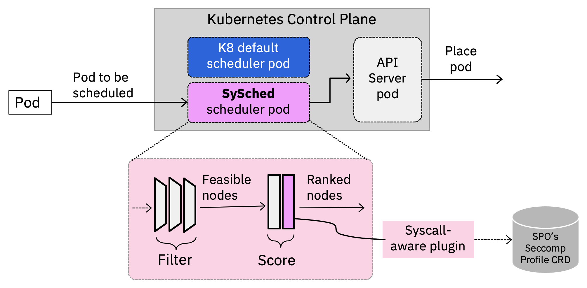
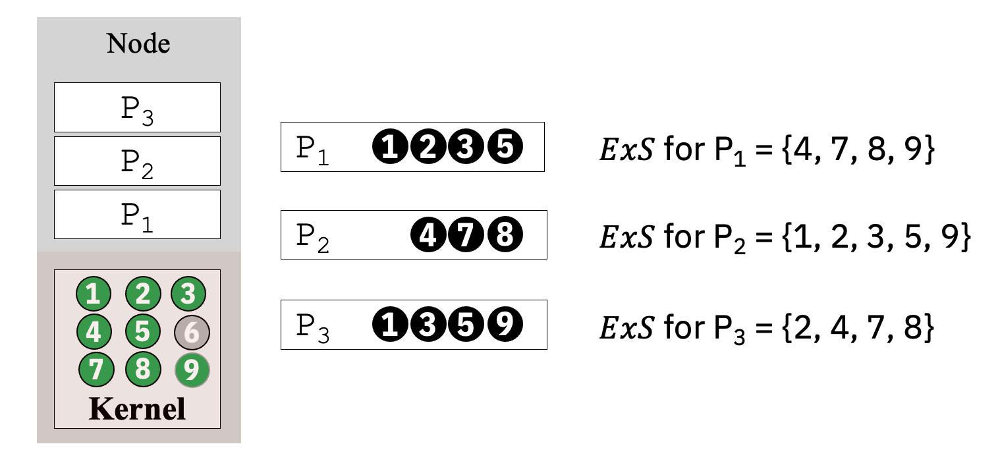
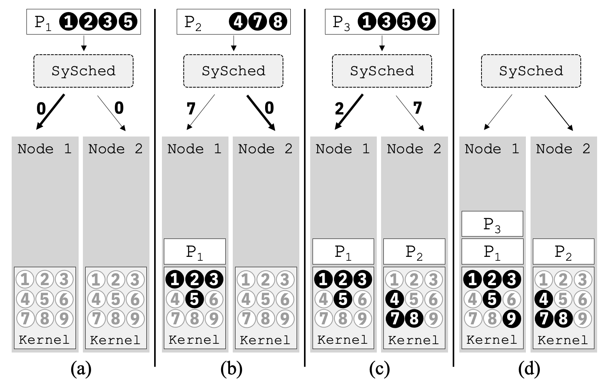

# KEP: SySched  - System call-based scheduling

## Summary

We propose the use of pod placement as a way to improve the security of nodes in a cluster. Specifically, we propose a new scheduler scoring plugin (SySched) that enables the ranking of feasible nodes based on the relative risks of pods' system call usage. Key to this risk calculation is the Extraneous System Call (ExS) metric -- a metric defined by us -- which measures the amount of excess system call a pod is exposed to on a given node. The benefits of this approach are the following:

1. reduce the number of victim pods that can be impacted by a "bad" pod, where a "bad" pod has one or more vulnerable system calls to exploit its host kernel.
2. reduce the number of nodes in a cluster that can be impacted by a "bad" pod
3. minimizes the "excess" system calls a pod may experience during its lifecycle, hence reduces needed system calls on a node, which in turns reduces the attack surface areas of a node.


## Motivation

Securing Kubernetes workloads despite the inevitability of vulnerabilities is a critical task. Particularly devastating are vulnerabilities in the host kernel that are exploitable via system calls to escalate privileges and break out of containment, as demonstrated by the infamous [Dirty COW](https://dirtycow.ninja/) or the recent [Dirty Pipe](https://dirtypipe.cm4all.com/) vulnerability. As a result, a pod's security depends on its neighboring pods and their system call usage since pods share a highly-privileged kernel on a host. Yet cloud providers strive to increase pod density to improve host utilization by multiplexing workloads from different users and tenants on the same set of physical nodes, providing ample opportunities for distrusting containers to become "bad neighbors."

While pod-centric security schemes such as seccomp are necessary, they alone are insufficient. We introduce a practical way to curtail the impact of these types of threats by leveraging a new security-aware pod scheduling scheme that we've developed for Kubernetes to co-locate pods based on their system call usage. So even if such attacks were successful, we show that it would impact fewer victim pods (up to 40% less) on fewer nodes (up to 1/3 less) in the cluster than the existing scheduler.
 
### Goals

1. Use a scheduler score plugin to rank candidate nodes for an incoming pod to improve pod security.
2. Compute ExS score for a pod w.r.t. a candidate node by comparing their system call profiles (stored as [CRDs](https://github.com/kubernetes-sigs/security-profiles-operator)) and add the normalized score to Kubernetes default scores.

<!---
2.  No impact when the scoring plugin is disabled
3.  When scoring plugin is enabled:
	-  Works in conjunction with other scoring plugins
	-  No impact if pod does not have an associated system call profile
	-  Improve pod security:

4.  Reduce the number of victim pods that can be impacted by a "bad" pod
5.  Reduce the number of nodes in a cluster that can be impacted by a "bad" pod
6.  Minimizes the "excess" system calls across all pods on a node and all nodes in a cluster
7.  Minimizes attack surface areas of a node (reduce needed system calls on a node)
--->

### Non-goals

1.  Use other pod security attributes as part of scheduling metric (only considering system call in initial version)
2.  Use existing Taint mechanism to implement above
3.  Descheduling or rescheduling a pod after placement if the system call condition on the node changes during a pod's lifetime.
4.  Automatically generating a system call profile of a pod

## Proposal

## User Stories

1. When diverse set of pods may be scheduled in a cluster, nodes of the cluster can have multiple pods using various system calls, where system calls used by one may not be used by its neighbors. Besides, one pod may have vulnerable or critical system calls that affect the security of a node as well as all the pods running on the node. SySched enables making placement decisions by examining the system call profile similarity of candidate nodes and an incoming pod.

2. Certain system calls might be deemed critical based on current or historical data. In such situations, a weight can be attached to the associated system calls which would let the scheduler further isolate the pods using those critical system calls from other pods.

### Notes/Constraints/Caveats

We assume the pod's configuration contains seccomp security context provided by the user or automatically configured using the Security Profile Operator (more on this below). We make use of the seccomp profile to retrieve what system calls are used by the pods. seccomp is also used to filter the system calls for each pod to enforce system call restriction.

Creating a seccomp profile that is inaccurate can result in pod execution failure. Creating an accurate seccomp filter can be challenging but this is an existing difficulty of using seccomp. The Security Profile Operator can be used to ease and automate this process.

### Risks and Mitigations

Pods with the same workload might get scheduled on the same set of nodes, potentially impacting performance. Can remedy this by applying existing tainting or anti-affinity policies to spread those pods out.

A security-aware scheduler scoring plugin (SySched) scores a node for an incoming pod by comparing the system call profile of the incoming pod with the system call profiles of existing pods in the node. It aims to co-locate pods with the same or similar system call profile for improving pod security while maintaining a high level of performance.

## Design Details: Overall architecture

SySched utilizes system call profiles of pods obtained through their security contexts in the form of seccomp profiles. It computes a score for each feasible node by comparing the system call profile of the pod with the system call profiles of the existing pods in the node. Our plugin keeps track of the placements of pods and their system call profiles using a lightweight in-memory cache to reduce the cost of querying the API server. To compute the scores, the plugin uses the ExS metric. We define the ExS metric to capture the system calls that a pod does not need, but are present in the node. Our plugin then returns the computed normalized ExS scores to be combined with other scores in Kubernetes for ranking candidate nodes. If a pod has no seccomp profile associated with it, then our plugin effectively is a no-op. The following figure shows the integration of our plugin with the Kubernetes scheduler.

<p align="center">

</p>

<p align="center">
<b>Figure 3: Overall architecture</b>
</p>

### Scheduling Metrics - Extraneous System Call (ExS)

At the heart of SySched is a single-valued score used to quantify the extraneous system call exposure of a pod on a node. Informally, ExS captures the additional system calls accessible on a node that the pod itself does not use. This score reflects the potential “danger” a pod must face when running on the target node as vulnerabilities in these extraneous system calls from neighboring pods can jeopardize its own security. 

For illustrative purpose, we consider a hypothetical node capable of executing nine system calls numbered from 1 to 9 in Figure 4. If we have three pods $P_1$, $P_2$, and $P_3$ in the node with their system call profiles $S_1 = \{1, 2, 3, 5\}$, $S_2 = \{4, 7, 8\}$, and $S_3 = \{1, 3, 5, 9\}$ respectively, we can obtain the ExS for pod $P_1$, $P_2$, and $P_3$ as follows.

> ExS for $P_2 = (S_1 \cup S_2 \cup S_3) - S_1 = \{1, 2, 3, 4, 5, 7, 8, 9\} - \{1, 2, 3, 5\} = \{4, 7, 8, 9\}$

> ExS for $P_2 = (S_1 \cup S_2 \cup S_3) - S_2 = \{1, 2, 3, 4, 5, 7, 8, 9\} - \{4, 7, 8\} = \{1, 2, 3, 5, 9\}$ 

> ExS for $P_3 = (S_1 \cup S_2 \cup S_3) - S_3 = \{1, 2, 3, 4, 5, 7, 8, 9\} - \{1, 3, 5, 9\} = \{2, 4, 7\}$ 


<p align="center">

</p>

<p align="center">
<b>Figure 4: Example ExS score calculation</b>
</p>

To express the computation of the ExS score as mathematical equations, let assume that all system calls in a node are numbered as $1, ..., M$. Let $\bm{S}_i^n$ represent the binary vector of enabled system calls for pod $i$ on node $n$: $\bm{S}_i^n = [s_1, s_2, ..., s_M]$, where $s_k = 1$ when the $k$-th system call is enabled, and $s_k = 0$ otherwise. Practically, $\bm{S}_i^n$ mirrors a typical **seccomp** policy for the corresponding pod.

To find the systems calls that are enabled a given node $n$, we perform a logical $or$ (union) of the enabled system calls across all pods within that node:  $$\bm{S}^n = \bigcup_i \bm{S}_i^n$$ 

We can now compute the vector, $\bm{E}_i^n = [e_1^n, e_2^n, ..., e_M^n]$, which represents the extraneous systems calls for pod $i$ on node $n$: $$ \bm{E}_i^n = \bm{S}_i^n \oplus \bm{S}^n$$


### Scheduling Plugin

<!-- We developed a new plugin to implement the scoring extension API point in the Kubernetes scheduler while leaving other filters and scoring plugins intact. We leverage existing filtering and scoring operations of the Kubernetes scheduler to handle other aspects of pod placement such as spreading the pods and ensuring resource availability. -->

There are two main components of our plugin: 1) a lightweight in-memory cache to synchronize with pod events for keeping an up-to-date state about what types of syscalls are present on what nodes, and 2) mechanisms for retrieving the system call sets used by pods for computing the ExS scores. The in-memory cache reduces the cost of querying the API server for each pod scheduling event. We obtain the system call profiles for pods from their seccomp profiles. Our plugin leverages the Kubernetes sigs community-developed [Security Profiles Operator](https://github.com/kubernetes-sigs/security-profiles-operator) that creates Custom Resource Definitions (CRDs) for seccomp profiles.

#### **How the Scheduler gets access to pods' system call profiles**
We assume that the system call profiles of pods have explicitly been made available to the scheduler via the [Security Profiles Operator](https://github.com/kubernetes-sigs/security-profiles-operator) (SPO). The scheduler can use the API server to access a pod's seccomp profile via the SPO's CRD.

The Kubernetes sigs community developed SPO that creates CRDs for seccomp profiles. One can manually create a seccomp profile CRD for a pod by specifying the allowed or denied system call list in the CRD's YAML file.

```
---
apiVersion: security-profiles-operator.x-k8s.io/v1beta1
kind: SeccompProfile
metadata:
  name: nginx-seccomp
  namespace: scheduler-plugins
spec:
  defaultAction: SCMP_ACT_LOG
  architectures:
  - SCMP_ARCH_X86_64
  syscalls:
  - action: SCMP_ACT_ALLOW
    names:
    - recvmsg
    - fchdir
    - sendfile
    - getdents64
    - setsockopt
    - recvfrom
    - sigaltstack
    - fstatfs
    - umask
    - getegid
    - read
	...
```

Alternatively, the operator can also be used to automate generating the seccomp profile. In the end, the operator creates the CRD and provides a relative path where the actual JSON file for the CRD is stored. One can then update the pod's security context using the relative path.

```
NAME            STATUS      AGE   LOCALHOSTPROFILE
nginx-seccomp   Installed   19h   operator/scheduler-plugins/nginx-seccomp.json
```


Optionally, SPO can also automate binding the seccomp profile to one or more pods. In the following binding specification, **nginx-seccomp** seccomp profile CRD is bounded with any pods where the pods use **nginx:1.16** image in the image tag.

```
---
apiVersion: security-profiles-operator.x-k8s.io/v1alpha1
kind: ProfileBinding
metadata:
  name: nginx-binding
  namespace: scheduler-plugins
spec:
  profileRef:
    kind: SeccompProfile
    name: nginx-seccomp
  image: nginx:1.16
```

When our plugin receives an incoming pod for computing ExS scores, the plugin first reads its annotation and retrieves the annotation done by the SPO. The plugin then obtains the namespace and seccomp profile CRD name from an SPO annotation (indicated by *seccomp.security.alpha.kubernetes.io*). A pod may have multiple annotations for multiple seccomp profile CRDs in different namespaces. In this case, the plugin reads all the CRDs and merges them to obtain the system call profile. Alternatively, a pod can have the seccomp profile CRD in its security context field instead of annotations. In this case, our plugin obtains the system call profile by reading the CRD indicated in the security context field. If a pod does not have a security context field or SPO annotations, then our plugin simply returns zero (0) as the ExS score for a node. This zero (0) ExS score does not impact the Kubernetes default scoring.

```
...
    spec:
      securityContext:
        seccompProfile:
          type: Localhost
          localhostProfile: operator/scheduler-plugins/nginx-seccomp.json
...
```

To obtain the SPO CRDs, we implement a clientset API using the group API end point and version as follows. This clientset allows us to interact and read the SPO CRDs.

```
func NewForConfig(c *rest.Config) (*SPOV1Alpha1Client, error) {
    config := *c
    config.GroupVersion = &schema.GroupVersion{
                Group: "security-profiles-operator.x-k8s.io", 
                Version: "v1beta1" }
    config.APIPath = "/apis"
    config.NegotiatedSerializer = scheme.Codecs.WithoutConversion()
    crdConfig.UserAgent = rest.DefaultKubernetesUserAgent()
  
    client, err := rest.RESTClientFor(&config)
    if err != nil {
        return nil, err
    }

    return &SPOV1Alpha1Client{restClient: client}, nil
}
```

<!-- The state store is implemented as a thread that listens to events of a pod’s lifecycle, e.g., creation, stop, destruction, run, etc. Using these event notifications, this thread tracks where pods are currently running in a cluster. When a pod stops running on a node, our plugin also removes it from its internal mapping. While the entire state of pod placement in a cluster can be retrieved dynamically by querying the API server, this can be an expensive task to do per pod scheduling event, hence we choose to maintain this state internally in our scheduler. -->


Administrator deploys the scheduler with the SySched scoring plugin enabled. Users may deploy their pod as usual. As pods are scheduled, the pods are automatically placed according to the pod's specified constraints and our security metric discussed above.


Figure 1 illustrates how our scoring algorithm works and how pods are placed. The figure shows the placement of three pods ($P_1$, $P_2$, and $P_3$) in  two nodes (Node 1 and Node 2). The numbers inside a pod indicate the system call profile of the pod, i.e., the profile for $P_1$ is $\{1, 2, 3, 5\}$, $P_2$ is $\{4, 7, 8\}$, and $P_3$ is $\{1, 3, 5, 9\}$. 

Initially, to schedule pod $P_1$, the ExS  scores for both Node 1 and Node 2 are the same (i.e., 0), since there are no pods running on the nodes (Figure 1(a)). Thus, our algorithm randomly picks one of the two nodes, Node 1 in this case, and updates Node 1's system call usage list using $P_1$'s system call profile (Figure 1(b)). When pod $P_2$ arrives to be scheduled, our plugin computes the ExS scores 7 and 0 for $P_2$ w.r.t. Node 1 and Node 2, respectively (Figure 1(b)). In this case, the scheduling algorithm picks Node 2 since Node 2 has a lower ExS  score. Figure 1(c) shows the updated system call lists for Node 2. This process repeats for all incoming pods. After all pods are placed, the cluster-wide ExS score in this example is 12, i.e., $ExS_1$ is 5 and $ExS_2$ is 7, where 1 and 2 are node numbers.

<p align="center">

</p>

<p align = "center">
<b>Figure 1. Scheduling algorithm and pod placement example</b>
</p>

Figure 2 highlights the opportunities not only for reducing the exposure to extraneous system calls (i.e., ExS score) but also the node’s attack surface. Imagine an OS with nine total system calls. On such a system, both nodes in Figure 2(a) would require providing access to 89% of system calls for a non-syscall-aware scheduler such as Kubernetes default scheduler. This is in contrast to the placement outcome when our syscall-aware scheduler is used (Figure 2(b)). In that scenario, Node 1 and Node 2 only require maintaining access to 56% and 67% of system calls, respectively.

<p align="center">

</p>

<p align="center">
<b>Figure 2: Syscall-aware scheduling reduces host attack surfaces</b>
</p>


<!--#### Story 2

Certain system calls might be deemed critical based on current or historical data. In such situations, a weight can be attached to the associated system calls which would let the scheduler further isolate the pods using those critical system calls from other pods.
-->


### Known limitations

-   System call profile associated with a pod must be accessible to the scheduler via the SPO's CRD
-   If there are not enough nodes or the variance in system call usage of the workload is small, the security benefit will be small, if any.
-   Generating a tight and complete system call profile for a pod is not trivial.

### Test plans

## Production Readiness Review Questionnaire

### Scalability

-   Will enabling / using this feature result in any new API calls?No.
-   Will enabling / using this feature result in introducing new API types?No.
-   Will enabling / using this feature result in any new calls to the cloud provider?No.
-   Will enabling / using this feature result in increasing size or count of the existing API objects?No.
-   Will enabling / using this feature result in increasing time taken by any operations covered by [existing SLIs/SLOs](https://git.k8s.io/community/sig-scalability/slos/slos.md#kubernetes-slisslos)?  Experiments are planned to evaluate the overhead.  However, it should be a negligible.
-   Will enabling / using this feature result in non-negligible increase of resource usage (CPU, RAM, disk, IO, ...) in any components?  No. A small amount of memory is used to hold pod topology and grows linearly with number of pods. The scoring algorithm is also linear when the total system call usage set for a node is cached. 

### Troubleshooting

-   How does this feature react if the API server and/or etcd is unavailable?  Running pods are not affected. Any new submissions would be rejected by scheduler.
-   What are other known failure modes?  N/A
-   What steps should be taken if SLOs are not being met to determine the problem? Disable the scoring plugin

### Graduation criteria

-   Alpha
	-   Pods are placed based on their system call profiles provided via seccomp files on the local file system of the scheduler
-   Beta
	-   User can define weights for each system call

## Implementation history

-   We have implemented this System Call-aware Scheduler (SySched) plugin for Kubernetes v1.23 and have evaluated the security benefits and performance impact to the cluster.
-   We have presented to the Scheduling-SIG on April 7th, 2022
-   Used the Security Profiles Operator to generate system call profiles for pods and bind them to the pods as seccomp filters
